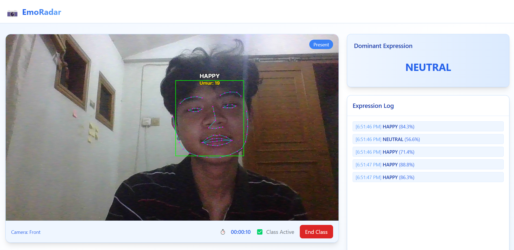

# 🎯 EmoRadar - Facial Expression Analysis

EmoRadar adalah aplikasi berbasis web yang menggunakan teknologi **Face API** untuk mendeteksi ekspresi wajah secara real-time dari kamera pengguna. Dirancang untuk kebutuhan pembelajaran, monitoring emosi, hingga keperluan presentasi interaktif yang canggih.



## 🚀 Fitur Unggulan

- 🎥 **Deteksi Wajah Real-Time** dari kamera depan
- 😊 **Analisis Ekspresi**: Bahagia, Sedih, Marah, Takut, Terkejut, dan lainnya
- 🧠 **Prediksi Usia & Landmark Wajah**
- 📊 **Ringkasan Ekspresi** kelas (summary)
- 🔔 **Notifikasi Ekspresi Dominan**
- 🎁 **Reward Emosi Positif**
- 🕒 **Timer Kelas + Status Hadir**
- 🧪 **Kontrol Dinamis**: Sembunyikan/lihat fitur ekspresi, usia, landmark

## 🛠️ Teknologi yang Digunakan

- `HTML5`, `Tailwind CSS` untuk tampilan responsif & modern
- `JavaScript` + [`face-api.js`](https://github.com/justadudewhohacks/face-api.js)
- Desain animatif dan ringan untuk pengalaman yang mulus

## 📦 Instalasi Lokal

> 💡 Tidak perlu server backend – sepenuhnya berjalan di sisi client.

### 1. Clone Repository

```bash
git clone https://github.com/username/emoradar.git
cd emoradar
